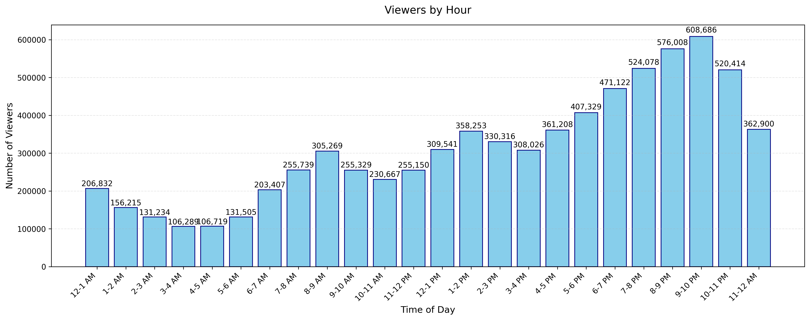

# NetView Viewership Forecasting Project

## Overview
Time series analysis and forecasting project for NetView's "Leaky Finders" finale viewership prediction using historical streaming data.

## Methods
### Implemented Models
- Simple Exponential Smoothing
- Double Exponential Smoothing  
- Triple Exponential Smoothing
- SARIMA Models
 - Baseline SARIMA
 - SARIMA with Bootstrap
 - Multiple Solver Methods

### Analysis Components
- Exploratory Data Analysis (EDA)
- Time Series Decomposition
- Pattern Recognition
- Seasonality Analysis
- Special Event Impact Analysis 

## Data
- Source: NetView_Viewership_Data.xlsx
- Type: Hourly viewership data
- Features:
 - Historical finale patterns
 - Daily viewing trends
 - Holiday impacts
 
## Project Structure
- plots\
- NetView_Viewership_Data.xlsx
- viewership_analysis.ipynb
- viewership_analysis.html
- viewership_analysis_init.html
- viewership_analysis.html
- README.md
- SARIMA_bootstrapping_preds.xlsx
- analysis.ipynb
- baseline_SARIMA_simple_train_test_split_preds.xlsx
- presentation.pptx

## Model Development
Training set: First 75% of data
Validation set: Remaining 25%
Optimization: Minimum Mean Absolute Error (MAE)

## Plots
Plots directory contains:

Model performance results
Comparative analysis
Visualization outputs

## Visualizations

### Time Series Analysis

### Viewership Patterns

### Special Events

